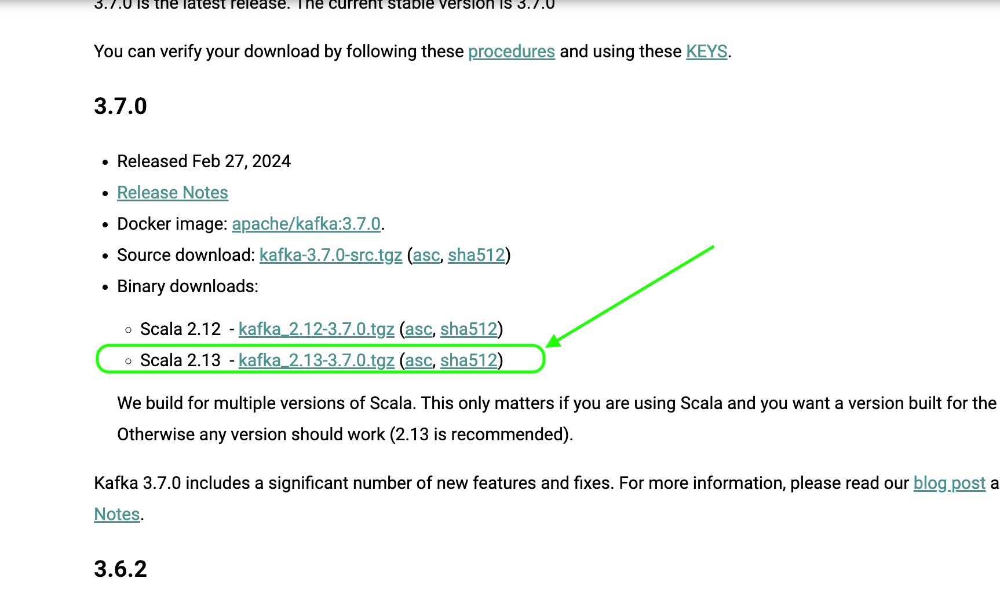
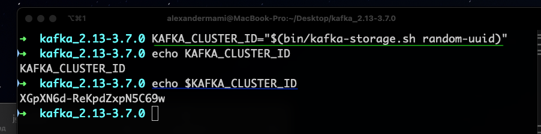
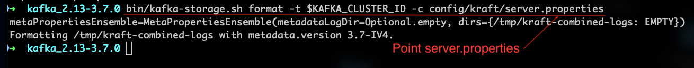
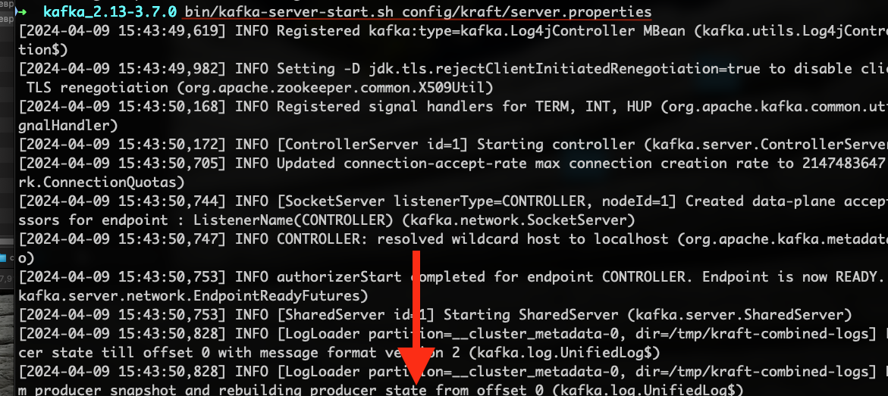
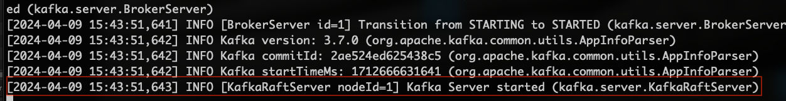

1 - Download Apache Kafka 
From official site

2 - Start Kafka
There is 2 ways to start Kafka :
- Zookeper
- KRaft
In this tutorial we will start it with Kraft
  
3 - After downloading Apache Kafka 
 We have the KRaft config files here \config\kraft
that we have to point before run the server.
We  will use the server.properties

3 - Launch the server
How we can start the server, we have `bin` folder and `bin\windows` 
where we will use scripts.

 3.1 - Generate a Cluster UUID

 3.2 - Format Log Directories
 

3.2 - Start the Kafka Server with default properties

