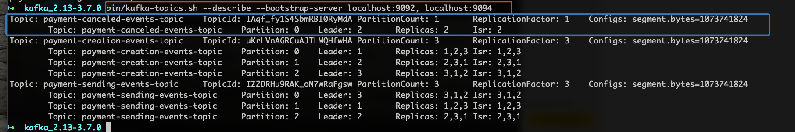

# Kafka Producer And Consumer CLI

For Mac or Linux we use `kafka-console-producer.sh` script

We must have our three servers up and running and topics created.

Let's look at the example where we don't have this topic `payment-canceled-events-topic`

Let's write this command 

We have error , after exit with `ctrl +c` 

It's not good practice because first we have an error after automatically a topic is created
with default parameters , let's see :

#### 1 - Send message (Publish, Produce)

`bin/kafka-console-producer.sh --topic payment-creation-events-topic --bootstrap-server localhost:9092,localhost:9094 --property "parse.key=true" --property "key.separator=:"`

#### 2 - Receive message (Consume)

For Mac or Linux we use `kafka-console-consumer.sh` script

In new tab let's write this command

`bin/kafka-console-consumer.sh --topic payment-creation-events-topic --bootstrap-server localhost:9092,localhost:9094 --from-beginning`

Look at those videos , we can add some options in command `--property "print.key=true"`

Consume without printing keys
https://youtu.be/Tg7Yrw8XzG4

Consume with printing keys
https://youtu.be/WOvoYe_zOR4

We can also remove `--from-beginning` flag 

