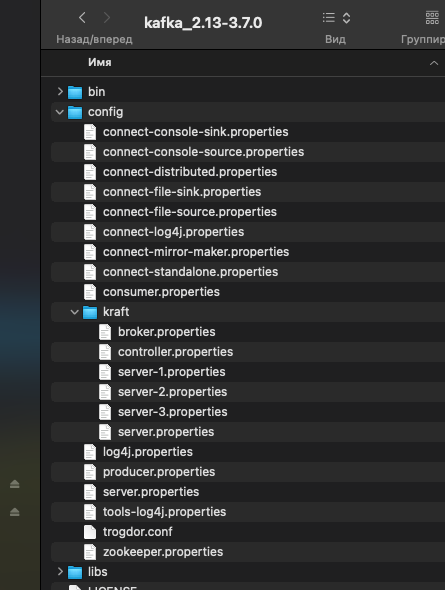
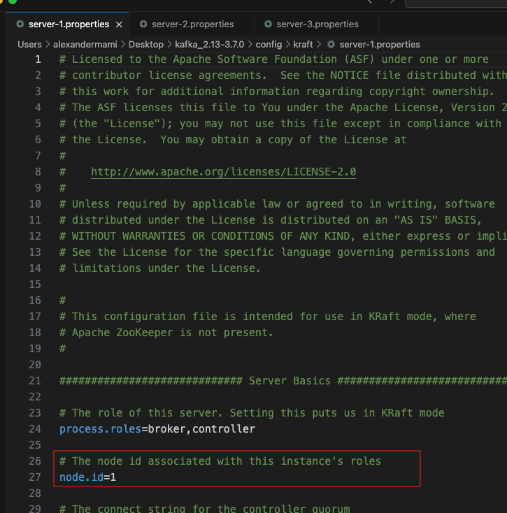
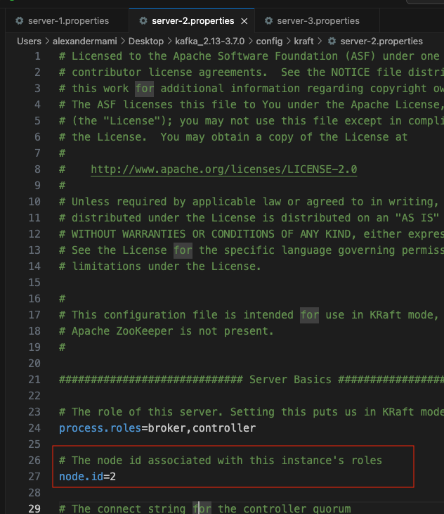
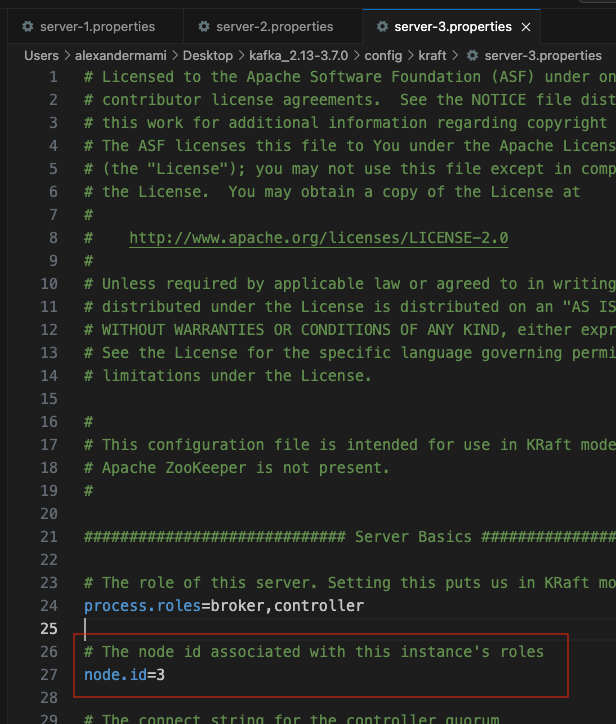
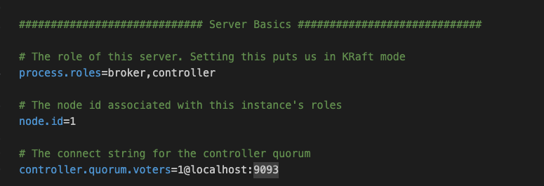
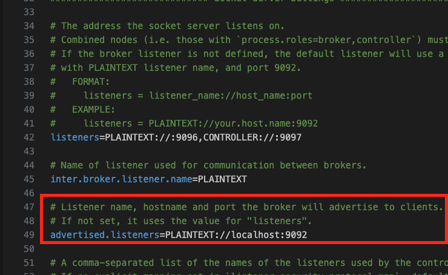
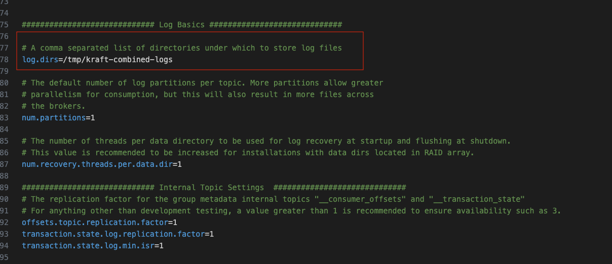
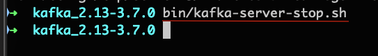

# Run several servers. Setup a Three-Node Kafka KRaft cluster

We will start 3 servers

1 - Config file for each server

We have to create 3 copy of `server.properties` that we will edit

2 - Update properties - the Node Id
Open in Visual Studio 3 properties files, and for each change the node id

3 - Update properties - listeners

For Server 1

`listeners=PLAINTEXT://:9092,CONTROLLER://:9093`

For Server 2

`listeners=PLAINTEXT://:9094,CONTROLLER://:9095`

For Server 3 

`listeners=PLAINTEXT://:9096,CONTROLLER://:9097`

4 - Update properties - controller,quorum.voters

For Server 1

Copy the same for other props

For Server 2
`controller.quorum.voters=1@localhost:9093,2@localhost:9095,3@localhost:9097`

For Server 3

`controller.quorum.voters=1@localhost:9093,2@localhost:9095,3@localhost:9097`

4 - Update properties - advertised.listeners

For each server set port  as for the listener 

4 - Update properties - log.dirs
For each server, we have to configure a directory for MetaData , logs, snapshots

For Server 1

`log.dirs=/tmp/server-1/kraft-combined-logs`

For Server 2

`log.dirs=/tmp/server-2/kraft-combined-logs`

For Server 3

`log.dirs=/tmp/server-3/kraft-combined-logs`

5 - Start the 3 servers

Open the terminal. Inside kafka directory
Generate a CLuster UUID and Format Log Directories for our three servers

Create 3 new tabs where we will launch servers

`bin/kafka-server-start.sh config/kraft/server-1.properties`
`bin/kafka-server-start.sh config/kraft/server-2.properties`
`bin/kafka-server-start.sh config/kraft/server-3.properties`

6 - Stop the 3 servers

