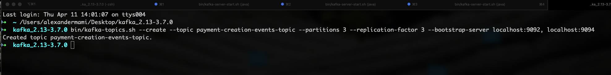
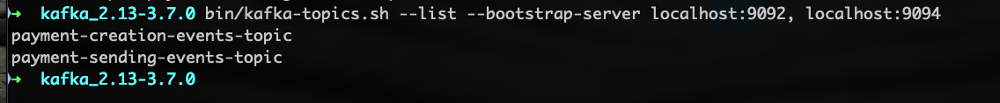
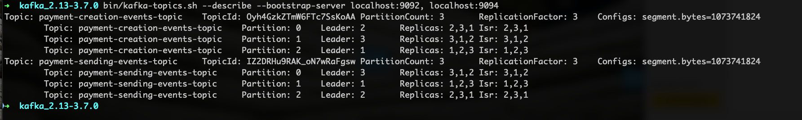
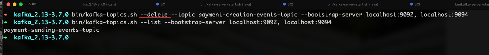

# Topic with CLI

#### 1 - Create a new topic

To create a new topic in Kafka using the command-line interface (CLI), you can use the kafka-topics.sh script 
provided by Kafka. 
Why CLI for java developers ?
 - Create new topic
 - List topics
 - View topic description
 - Change topic

Useful when we test. 
For Mac and Linux users we have `kafka-topic.sh` script , for Windows users we have
`kafka-topic.bat`

If the servers are not running, let's start all three servers and in new tab write the
command to create a new topic

`bin/kafka-topics.sh --create --topic payment-creation-events-topic --partitions 3 --replication-factor 3 --bootstrap-server localhost:9092, localhost:9094`
All 3 servers in cluster are running

Let's create another topic `payment-sending-events-topic`

#### 2 - List topics

#### 3 - Describing topics

This command is used to describe topics in Apache Kafka cluster.

`bin/kafka-topics.sh --describe --bootstrap-server localhost:9092, localhost:9094`

#### 4 - Delete topic
`bin/kafka-topics.sh --delete --topic payment-creation-events-topic --bootstrap-server localhost:9092, localhost:9094`

